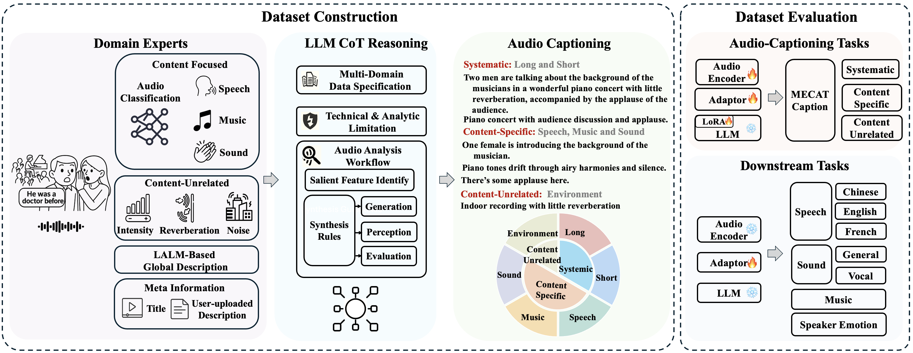

## ACAVCaps: Enabling Large-Scale Training for Fine-Grained and Diverse Audio Understanding
[**📖 arXiv**](https://arxiv.org/abs/2603.24038) | [**📊 Benchmark Project (MECAT)**](https://github.com/xiaomi-research/mecat) | [**📥 Download**](./src)

## Table of Contents
- [1. Introduction](#1-introduction)
- [2. Dataset Summary](#2-dataset-summary)
- [3. Dataset Structure](#3-dataset-structure)
- [4. Generation Pipeline](#4-generation-pipeline)
- [5. Example Data](#5-example-data)
- [6. Benchmark Performance](#6-benchmark-performance)
- [7. Citation](#7-citation)
- [8. Contributing](#8-contributing)
- [9. License](#9-license)

## 1. Introduction

ACAVCaps is a large-scale, fine-grained, and multi-faceted audio captioning dataset derived from the ACAV100M collection. It is designed to address the scarcity of high-quality, detailed audio descriptions at scale by utilizing a multi-expert pipeline and Chain-of-Thought (CoT) reasoning.

<div align="center">
  
</div>

## 2. Dataset Summary

- **Scale**: Approximately 4.7 million audio-text pairs
- **Lexical Diversity**: Contains 76.7k unique tokens (as measured by the Qwen3 tokenizer), offering a 61% increase in unique tokens over combined baseline datasets despite a 21% smaller sample size
- **Domain Coverage**: Extended multi-domain coverage including speech, music, sound events, combinations thereof, and silence
- **Description Strategy**: Multi-faceted captions generated from diverse perspectives: holistic environment, speech attributes, music characteristics, and specific sound events

### Comparison with Existing Caption Datasets

The following table compares ACAVCaps with existing caption datasets. The Unique Tokens column reports the total number of unique tokens within each dataset, as counted by the Qwen3 tokenizer.

**Legend**: 
- † MP-LLM: Multiple Experts Models and LLM
- ‡ Multi-Domain: This includes speech, music and sound-events (◇ denotes that domain were not elaborated in detail)
- § Extended Multi-Domain: This includes speech, music, sound-events, combinations thereof, and silence

<table class="tg">
  <thead>
    <tr>
      <th class="tg-lboi">Labeling</th>
      <th class="tg-lboi">Dataset</th>
      <th class="tg-lboi">Samples</th>
      <th class="tg-lboi">Unique Tokens</th>
      <th class="tg-lboi">Domain</th>
      <th class="tg-lboi">Source</th>
    </tr>
  </thead>
  <tbody>
    <tr>
      <td class="tg-lboi" rowspan="3">Manual</td>
      <td class="tg-lboi">AudioCaps</td>
      <td class="tg-lboi">50k</td>
      <td class="tg-lboi">5.5k</td>
      <td class="tg-lboi">Multi-Domain<sup>‡,◇</sup></td>
      <td class="tg-lboi">AudioSet</td>
    </tr>
    <tr>
      <td class="tg-lboi">Clotho</td>
      <td class="tg-lboi">3.8k</td>
      <td class="tg-lboi">5.5k</td>
      <td class="tg-lboi">Multi-Domain<sup>‡,◇</sup></td>
      <td class="tg-lboi">FreeSound</td>
    </tr>
    <tr>
      <td class="tg-lboi">SongDescriber</td>
      <td class="tg-lboi">0.4k</td>
      <td class="tg-lboi">2.4k</td>
      <td class="tg-lboi">Music</td>
      <td class="tg-lboi">MTG-Jamendo</td>
    </tr>
    <tr>
      <td class="tg-lboi" rowspan="6">LLM</td>
      <td class="tg-lboi">MusicCaps</td>
      <td class="tg-lboi">4.6k</td>
      <td class="tg-lboi">4.6k</td>
      <td class="tg-lboi">Music</td>
      <td class="tg-lboi">AudioSet</td>
    </tr>
    <tr>
      <td class="tg-lboi">LPMusicCaps</td>
      <td class="tg-lboi">21.6k</td>
      <td class="tg-lboi">5.1k</td>
      <td class="tg-lboi">Music</td>
      <td class="tg-lboi">Audioset, MSD</td>
    </tr>
    <tr>
      <td class="tg-lboi">WavCaps</td>
      <td class="tg-lboi">0.4M</td>
      <td class="tg-lboi">23.1k</td>
      <td class="tg-lboi">Multi-Domain<sup>‡,◇</sup></td>
      <td class="tg-lboi">AudioSet</td>
    </tr>
    <tr>
      <td class="tg-lboi">Auto-ACD</td>
      <td class="tg-lboi">1.9M</td>
      <td class="tg-lboi">20.3k</td>
      <td class="tg-lboi">Multi-Domain<sup>‡,◇</sup></td>
      <td class="tg-lboi">AudioSet</td>
    </tr>
    <tr>
      <td class="tg-lboi">Sound-VeCaps</td>
      <td class="tg-lboi">1.6M</td>
      <td class="tg-lboi">42.7k</td>
      <td class="tg-lboi">Multi-Domain<sup>‡,◇</sup></td>
      <td class="tg-lboi">AudioSet</td>
    </tr>
    <tr>
      <td class="tg-lboi">AudioSetCaps</td>
      <td class="tg-lboi">2.0M</td>
      <td class="tg-lboi">20.9k</td>
      <td class="tg-lboi">Multi-Domain<sup>‡,◇</sup></td>
      <td class="tg-lboi">AudioSet</td>
    </tr>
    <tr>
      <td class="tg-lboi">MP-LLM<sup>†</sup></td>
      <td class="tg-lboi"><strong>ACAVCaps (Ours)</strong></td>
      <td class="tg-lboi"><strong>4.7M</strong></td>
      <td class="tg-lboi"><strong>76.7k</strong></td>
      <td class="tg-lboi"><strong>Extended Multi-Domain<sup>§</sup></strong></td>
      <td class="tg-lboi"><strong>ACAV100M</strong></td>
    </tr>
  </tbody>
</table>

**Dataset Size vs. Lexical Diversity**: When compared to a merged baseline combining four major datasets (AudioSetCaps, Auto-ACD, WavCaps, Sound-VeCaps) with 5.97M samples, ACAVCaps achieves superior lexical diversity with fewer samples. Specifically, ACAVCaps (4.7M samples) contains 76.7k unique tokens, representing a 61% increase over the 47.6k unique tokens found in the larger 6M-sample baseline, despite having 21% fewer samples.

## 3. Dataset Structure

The dataset is organized by content composition to facilitate targeted training and evaluation. The sample distribution across major categories is as follows:

<table class="tg"><thead>
  <tr>
    <th class="tg-lboi">Category Code</th>
    <th class="tg-lboi">Description</th>
    <th class="tg-lboi">Sample Count</th>
  </tr></thead>
<tbody>
  <tr>
    <td class="tg-lboi">00A</td>
    <td class="tg-lboi">Pure Sound Events</td>
    <td class="tg-lboi">58,268</td>
  </tr>
  <tr>
    <td class="tg-lboi">0M0</td>
    <td class="tg-lboi">Pure Music</td>
    <td class="tg-lboi">623,223</td>
  </tr>
  <tr>
    <td class="tg-lboi">0MA</td>
    <td class="tg-lboi">Music + Sound Events</td>
    <td class="tg-lboi">28,229</td>
  </tr>
  <tr>
    <td class="tg-lboi">S00</td>
    <td class="tg-lboi">Pure Speech</td>
    <td class="tg-lboi">2,209,982</td>
  </tr>
  <tr>
    <td class="tg-lboi">S0A</td>
    <td class="tg-lboi">Speech + Sound Events</td>
    <td class="tg-lboi">446,834</td>
  </tr>
  <tr>
    <td class="tg-lboi">SM0</td>
    <td class="tg-lboi">Speech + Music</td>
    <td class="tg-lboi">1,209,545</td>
  </tr>
  <tr>
    <td class="tg-lboi">SMA</td>
    <td class="tg-lboi">Speech + Music + Sound Events</td>
    <td class="tg-lboi">87,994</td>
  </tr>
</tbody></table>

> ⚠️ **Note on Data Access**: Due to copyright restrictions, we only provide text information (captions and metadata) in the dataset. The original audio/video files are not included. Users can download the original content using the `key` field in the JSONL files. Each `key` represents the corresponding YouTube video ID and the start/end timestamps.


## 4. Generation Pipeline

ACAVCaps captions are synthesized using a multi-stage process:

1. **Multi-Expert Annotation**: Audio is analyzed by specialized models to extract structured metadata, including AudioSet labels, speech transcripts (ASR), speaker attributes, music tempo/mood, and acoustic properties like reverberation and signal intensity.

2. **LLM-CoT Synthesis**: A Large Language Model (Deepseek-R1) employs a Chain-of-Thought strategy to distill these disparate outputs into rich, stylistically varied, and semantically consistent descriptions.

## 5. Example Data

The following example demonstrates the data format in ACAVCaps. Each sample contains multi-faceted captions from different perspectives. The `key` field follows the format `{YouTube_ID}_{start_time}_{end_time}`, where the start and end times are in seconds (e.g., `166_48` represents 166.48 seconds).

### Example: Sound Events (00A)

```json
{
  "wo8sFEF7sWM_166_48_176_48": {
    "long": [
      "A train horn sounds repeatedly while metallic clattering grows louder, accompanied by constant background static and electrical interference throughout the recording.",
      "Sustained train horn blasts merge with increasing rail friction noise and persistent audio distortion",
      "Metallic rolling sounds intensify alongside train horn signals, with continuous low-quality background hum"
    ],
    "short": [
      "Train horn blaring with metallic rolling sounds and persistent static",
      "Train movement noises with horn blast and electrical interference",
      "Railway sounds featuring locomotive horn and track rumble amid distortion"
    ],
    "speech": [
      "None",
      "No discernible speech content",
      "Absence of human vocalizations"
    ],
    "music": [
      "None",
      "No musical elements detected",
      "Absence of rhythmic or melodic content"
    ],
    "sound": [
      "Train horn activation followed by increasing metallic rolling friction sounds",
      "Locomotive warning signals accompanied by track vibration noises",
      "Rail transport sounds featuring horn bursts and wheel-rail interaction"
    ],
    "environment": [
      "Open-air recording with distant mechanical sources and electrical interference",
      "Outdoor environment capturing industrial noises with recording artifacts",
      "Field recording containing transportation sounds and equipment distortion"
    ]
  }
}
```

**Key Format**: `wo8sFEF7sWM_166_48_176_48`
- YouTube ID: `wo8sFEF7sWM`
- Start time: 166.48 seconds
- End time: 176.48 seconds

## 6. Benchmark Performance

To rigorously evaluate the effectiveness of ACAVCaps, we trained identical model architectures using different datasets. Our evaluation pipeline consists of two stages:
1. **Alignment (Captioning Task)**: We use the audio captioning task to align modalities by training the **Audio Encoder**, the **Modality Projector**, and applying **LoRA to the Large Language Model (LLM)**.
2. **Generalization (Downstream Tasks)**: We freeze both the **Audio Encoder** and the **LLM**, and fine-tune the model on specific downstream tasks to assess its generalization capabilities across different domains.

### 6.1 Audio Captioning Performance (MECAT-Caption)

The table below presents the zero-shot audio captioning performance using the **DATE** metric. ACAVCaps achieves a comprehensive state-of-the-art across all fine-grained sub-categories.

<table style="width:100%; text-align:center; border-collapse: collapse;" border="1">
  <thead>
    <tr>
      <th rowspan="3">Training Dataset</th>
      <th colspan="2">Systematic</th>
      <th colspan="6">Content-Related</th>
      <th rowspan="2">Content-Unrelated</th>
      <th rowspan="3">Score</th>
    </tr>
    <tr>
      <th rowspan="2">Long</th>
      <th rowspan="2">Short</th>
      <th colspan="2">Speech</th>
      <th colspan="2">Music</th>
      <th colspan="2">Sound</th>
    </tr>
    <tr>
      <th>Pure</th>
      <th>Mixed</th>
      <th>Pure</th>
      <th>Mixed</th>
      <th>Pure</th>
      <th>Mixed</th>
      <th>Environment</th>
    </tr>
  </thead>
  <tbody>
    <tr>
      <td style="text-align:left;">AudioSetCaps [10]</td>
      <td><u>52.4</u></td><td>52.0</td><td><u>30.2</u></td><td>31.4</td><td>44.3</td><td><u>30.9</u></td><td>52.4</td><td><u>21.6</u></td><td><u>15.4</u></td><td><u>37.4</u></td>
    </tr>
    <tr>
      <td style="text-align:left;">Auto-ACD [8]</td>
      <td>47.3</td><td>50.0</td><td>29.1</td><td>31.0</td><td>26.9</td><td>21.9</td><td>49.5</td><td>18.9</td><td>11.0</td><td>32.8</td>
    </tr>
    <tr>
      <td style="text-align:left;">WavCaps [7]</td>
      <td>47.3</td><td>50.9</td><td>27.3</td><td>30.1</td><td>15.9</td><td>19.4</td><td>46.5</td><td>20.0</td><td>9.2</td><td>31.4</td>
    </tr>
    <tr>
      <td style="text-align:left;">Sound-VeCaps [9]</td>
      <td>47.0</td><td>49.7</td><td>29.1</td><td>30.3</td><td>27.2</td><td>21.9</td><td>49.8</td><td>18.7</td><td>11.4</td><td>32.8</td>
    </tr>
    <tr>
      <td style="text-align:left;">Combined<sup>†</sup></td>
      <td>52.2</td><td><u>54.1</u></td><td><u>30.2</u></td><td><u>32.2</u></td><td><u>45.4</u></td><td>23.3</td><td><u>52.7</u></td><td>20.2</td><td>11.1</td><td>36.6</td>
    </tr>
    <tr>
      <td style="text-align:left;"><strong>ACAVCaps (Ours)</strong></td>
      <td><strong>76.6</strong></td><td><strong>75.7</strong></td><td><strong>64.2</strong></td><td><strong>64.9</strong></td><td><strong>60.5</strong></td><td><strong>41.1</strong></td><td><strong>59.5</strong></td><td><strong>28.0</strong></td><td><strong>34.8</strong></td><td><strong>60.9</strong></td>
    </tr>
  </tbody>
</table>

### 6.2 Downstream Task Generalization

After the alignment stage, the frozen Audio Encoder and LLM are fine-tuned on various downstream datasets. The results demonstrate that models pre-trained on ACAVCaps yield substantial improvements, particularly in Speech tasks (measured by Error Rate, lower is better) and Emotion recognition.

<table style="width:100%; text-align:center; border-collapse: collapse;" border="1">
  <thead>
    <tr>
      <th rowspan="3">Training Dataset</th>
      <th colspan="6">Speech ↓</th>
      <th colspan="2">Sound ↑</th>
      <th>Music ↑</th>
      <th>Other ↑</th>
    </tr>
    <tr>
      <th colspan="3">AISHELL-2</th>
      <th colspan="2">LibriSpeech</th>
      <th>Common Voice</th>
      <th rowspan="2">General<br>(VGGSound)</th>
      <th rowspan="2">Vocal<br>(VocalSound)</th>
      <th rowspan="2">Instrument<br>(NSynth)</th>
      <th rowspan="2">Emotion<br>(IEMOCAP)</th>
    </tr>
    <tr>
      <th>Android</th>
      <th>IOS</th>
      <th>MIC</th>
      <th>Clean</th>
      <th>Other</th>
      <th>French</th>
    </tr>
  </thead>
  <tbody>
    <tr>
      <td style="text-align:left;">AudioSetCaps</td>
      <td><u>82.7</u></td><td>77.8</td><td>81.7</td><td>51.6</td><td>70.2</td><td>84.7</td><td>22.4</td><td>91.4</td><td><u>67.0</u></td><td>17.6</td>
    </tr>
    <tr>
      <td style="text-align:left;">Auto-ACD</td>
      <td>89.1</td><td>78.2</td><td>88.6</td><td>54.6</td><td>76.5</td><td>85.7</td><td>22.5</td><td>90.2</td><td>46.1</td><td><u>24.1</u></td>
    </tr>
    <tr>
      <td style="text-align:left;">WavCaps</td>
      <td>83.2</td><td><u>74.2</u></td><td><u>77.9</u></td><td>54.3</td><td>74.0</td><td>85.2</td><td>21.2</td><td>91.5</td><td><strong>69.1</strong></td><td>19.9</td>
    </tr>
    <tr>
      <td style="text-align:left;">Sound-VeCaps</td>
      <td>87.3</td><td>79.5</td><td>87.9</td><td>51.8</td><td>70.1</td><td>85.6</td><td><u>22.9</u></td><td>90.8</td><td>45.0</td><td>20.3</td>
    </tr>
    <tr>
      <td style="text-align:left;">Combined<sup>†</sup></td>
      <td>84.2</td><td>76.4</td><td>82.3</td><td><u>41.5</u></td><td><u>59.4</u></td><td><u>83.0</u></td><td><strong>34.6</strong></td><td><strong>92.6</strong></td><td>44.0</td><td>19.8</td>
    </tr>
    <tr>
      <td style="text-align:left;"><strong>ACAVCaps (Ours)</strong></td>
      <td><strong>58.3</strong></td><td><strong>56.5</strong></td><td><strong>57.1</strong></td><td><strong>19.7</strong></td><td><strong>33.7</strong></td><td><strong>50.0</strong></td><td>20.4</td><td><u>92.1</u></td><td>64.7</td><td><strong>28.9</strong></td>
    </tr>
  </tbody>
</table>

> *† Combined refers to the combination of AudioSetCaps, Auto-ACD, WavCaps, and Sound-VeCaps.*
> *For Speech tasks, the metric is Error Rate (lower is better, ↓). For Sound, Music, and Other tasks, the metric is Accuracy (higher is better, ↑).*
> *The <strong>best</strong> results are highlighted in bold, and the <u>second best</u> results are underlined.*

## 7. Citation

If you find our repository useful in your research, please consider citing our corresponding papers depending on the specific resources you use:

For the training dataset (ACAVCaps):

```bibtex
@inproceedings{niu2026acavcaps,
  title={ACAVCaps: Enabling Large-Scale Training for Fine-Grained and Diverse Audio Understanding},
  author={Niu, Yadong and Wang, Tianzi and Dinkel, Heinrich and Sun, Xingwei and Zhou, Jiahao and Li, Gang and Liu, Jizhong and Zhang, Junbo and Luan, Jian},
  journal={arXiv preprint arXiv:2603.24038},
  year={2026}
}
```
For the evaluation benchmark (MECAT) or related testing methodologies:
```bibtex
@article{mecat2025,
  title={MECAT: A Multi-Experts Constructed Benchmark for Fine-Grained Audio Understanding Tasks},
  author={Niu, Yadong and Wang, Tianzi and Dinkel, Heinrich and Sun, Xingwei and Zhou, Jiahao and Li, Gang and Liu, Jizhong and Liu, Xunying and Zhang, Junbo and Luan, Jian},
  journal={arXiv preprint arXiv:2507.23511},
  year={2025}
}
```

## 8. Contributing

[Yadong Niu](https://github.com/nyd3001) · [Tianzi Wang](https://github.com/Jzmo) · [Heinrich Dinkel](https://github.com/RicherMans) · [Xingwei Sun](https://github.com/xingws) · [Jiahao Zhou](https://github.com/zhoukezi) · [Gang Li](https://github.com/GrantL10) · [Jizhong Liu](https://github.com/frankenliu) · [Junbo Zhang](https://github.com/jimbozhang) · [Jian Luan](https://github.com/jianluan)


## 9. License

The dataset of the project is under the **Creative Commons Attribution-NonCommercial 4.0 International (CC-BY-NC 4.0) license**.